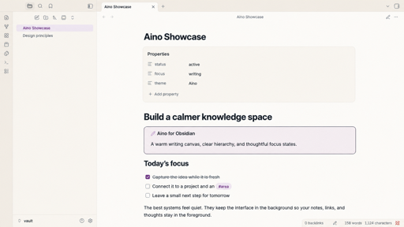
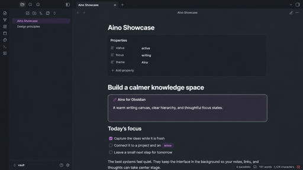

# Aino

Aino is a warm, focused theme for Obsidian, shaped around a calm semantic color system.

It brings Aino's cream writing surfaces, cool slate text, soft purple accents, and restrained elevation to Obsidian while keeping the interface familiar and accessible.





## Continue with Aino and LifeOS

Aino theme is part of a broader local-first Markdown ecosystem:

- [**Aino**](https://aino.md/) — an AI-first Markdown workspace for notes, tasks, calendar planning, reviews, and custom AI apps. Open your existing Obsidian vault directly and keep your files local.
- [**LifeOS for Obsidian**](https://lifeos.md/) — a complete Obsidian productivity system with tasks, calendars, periodic notes, AI-assisted knowledge workflows, and ready-to-use example vaults.

## Highlights

- Complete light and dark modes.
- A warm writing canvas with clearly separated sidebars and elevated surfaces.
- Accessible link, button, selection, and keyboard-focus states.
- Polished Markdown, metadata, callouts, tables, tags, Canvas, and graph colors.
- System fonts and local CSS only: no external font, image, or network dependency.
- Reduced-motion support and no `!important` or expensive `:has()` selectors.

## Manual installation

1. Download `manifest.json` and `theme.css` from the latest release.
2. Create `<your-vault>/.obsidian/themes/Aino/`.
3. Copy both files into that folder.
4. In Obsidian, open **Settings → Appearance → Themes** and choose **Aino**.

## Development

```bash
npm install
npm run check
```

The manifest requires Obsidian 1.10.6 or later. The theme uses CSS variables wherever Obsidian exposes them and keeps its small selector layer limited to Aino-specific polish.

## Release checklist

1. Run `npm version patch`, `npm version minor`, or `npm version major`.
2. Verify that `manifest.json`, `versions.json`, and `package.json` share the intended version.
3. Run `npm run check` and test light and dark modes in Obsidian on desktop and mobile.
4. Push a tag that exactly matches the manifest version.
5. Review and publish the draft GitHub release created by the included workflow.
6. Confirm that the release contains `manifest.json` and `theme.css` as binary attachments.

See the [official Obsidian theme submission guide](https://docs.obsidian.md/themes/app-themes/submit-theme) before submitting or updating the community-directory entry.

## 中文说明

Aino 是一款为 Obsidian 打造的温暖、专注的主题，支持完整深浅色模式。它采用暖米白内容面、灰蓝文字、柔和紫粉强调色和克制的层级阴影，同时优先保证长时间书写、键盘导航和正文可读性。

### 探索更多

- [**Aino**](https://aino.md/)：本地优先的 AI Markdown 工作空间，覆盖笔记、任务、日历规划、复盘和自定义 AI 应用，可直接打开现有 Obsidian 仓库。
- [**LifeOS for Obsidian**](https://lifeos.md/)：完整的 Obsidian 效率系统，提供任务、日历、周期笔记、AI 知识工作流和可直接使用的示例库。

手动安装时，将 `manifest.json` 与 `theme.css` 放入 `<你的仓库>/.obsidian/themes/Aino/`，然后在 Obsidian 的 **设置 → 外观 → 主题** 中选择 **Aino**。

## License

[MIT](./LICENSE) © 2026 quanru
